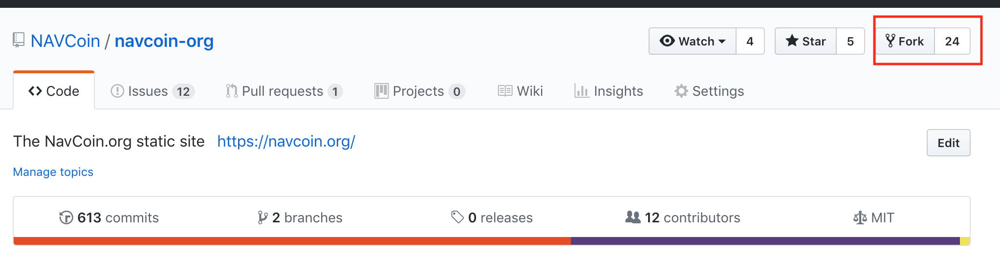
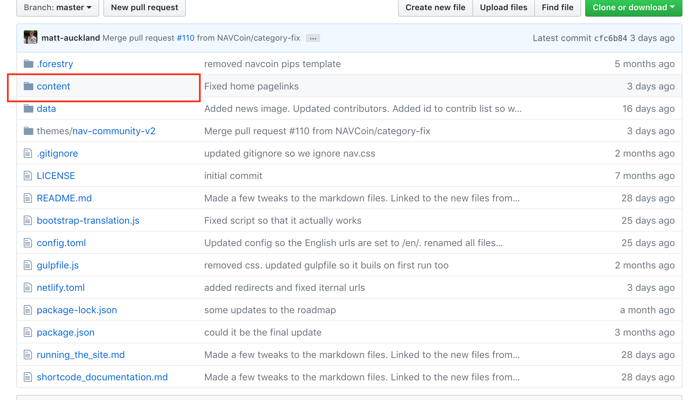
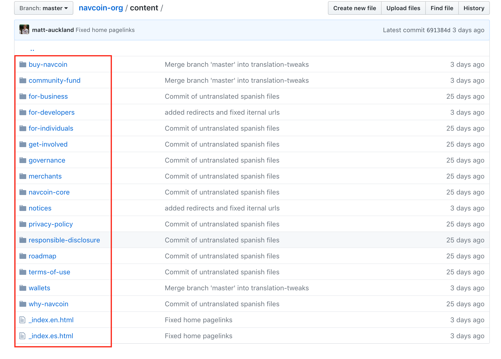
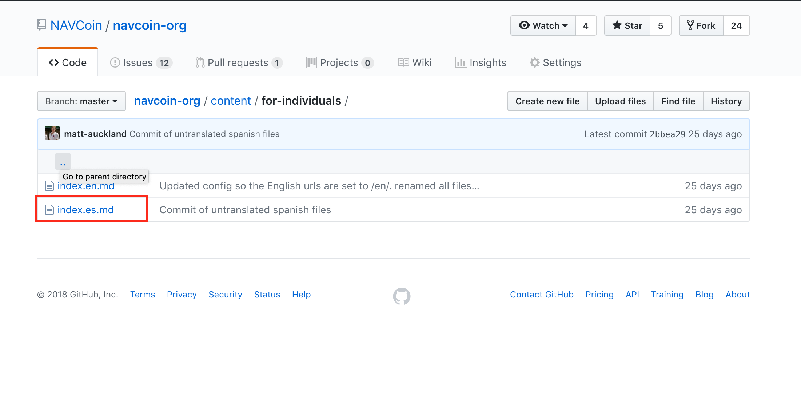
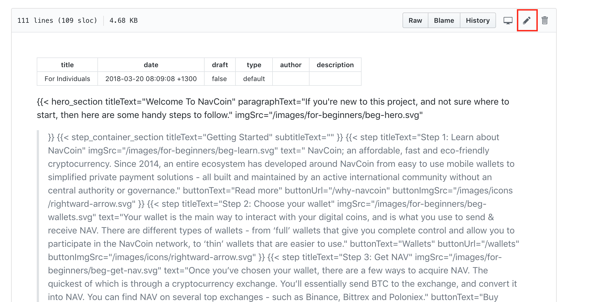
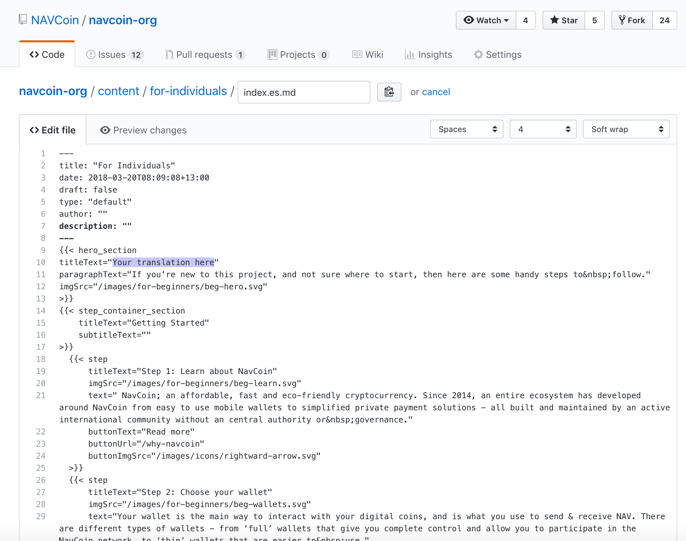
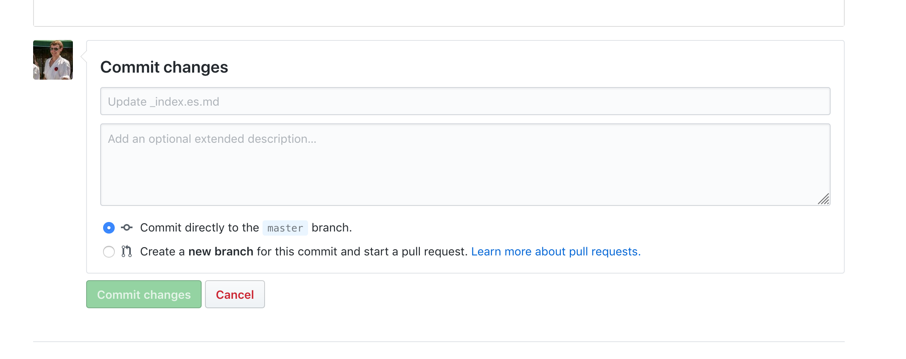
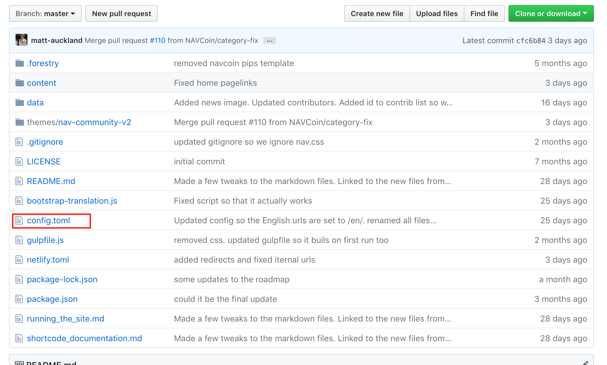
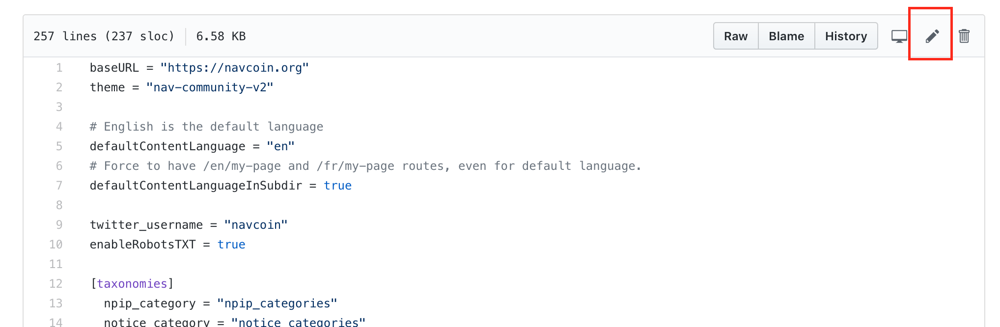
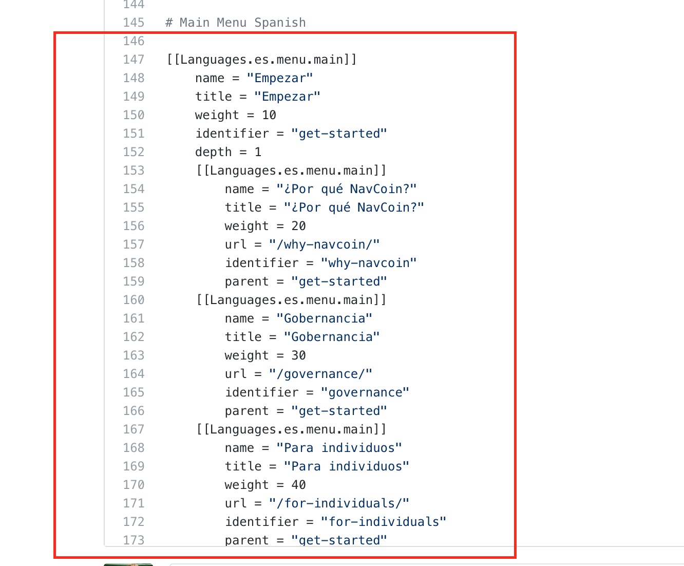

# Translating NavCoin.org content

> This guide is for the Spanish translation, the same steps will work for other langauges but first we need to create the template files for you to translate so contact me (Matt) to get that done. I have a JS script `bootstrap-translation.js` that will duplicate the files for you, so use that if you know how.

First make sure you're signed up and logged in to https://github.org.
Then visit https://github.org/navcoin/navcoin-org.

## Duplicate the website's code

Click the 'Fork' button highlighted in the picture. This will create a copy that you can edit.

## What files do I edit?

Click to open up the `content` folder

Inside are a number of folders that contain files you can edit. The `_index.es.html` can also be edited.

If you open up one of these folders you will see an `index.es.md` file. Click on this to open it.

Click the highlighted button to edit the file

Make your edits in the file. Translate any existing English text. If you see codes like `&nbsp;`, make sure to add it to your translation between the last two words. e.g. `esta es una oración de&nbsp;ejemplo`

When you are done editing, or wish to save your progress, scroll to the bottom of the page and use the 'Commit Changes' section. You can write a message in here summarising your changes if you wish.

## Translating the menus

If you want to edit the navigation menus do the follow. (I am assmumming you have already forked the repository as instructed above).

Click on `config.toml` to open it, this is where we store the navigation menu data.

Click on the edit button to edit the file.

Scroll down to the section that contains the `Main Menu Spanish` and edit this text. **You only need to edit the `name` and `title` fields**, editing the other fields may break the menu.

And then save the file as usual.

## Finishing up

When you are finished with your tranlation, contact me (Matt) for help on getting your changes live. Or just make a pull request if you know how.